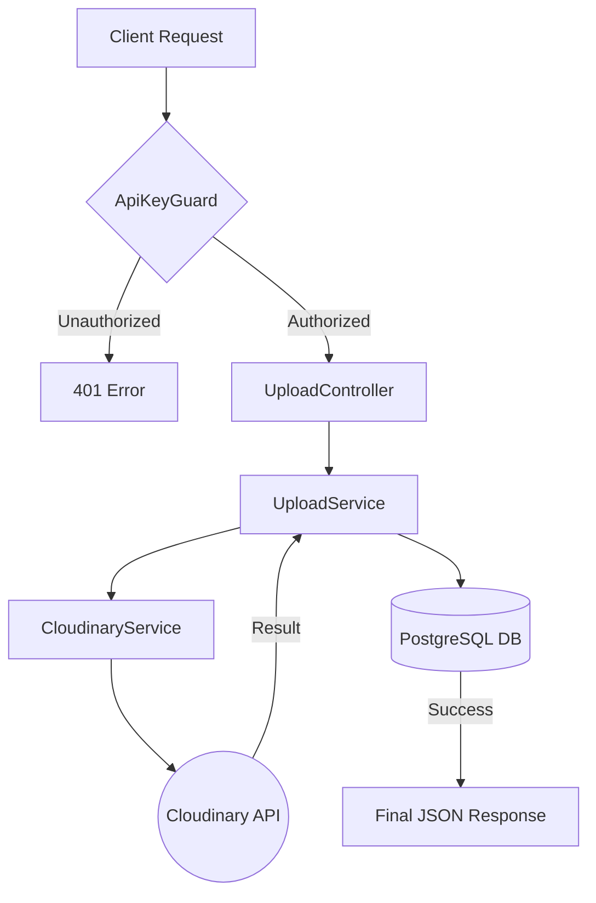

# System Architecture Documentation

This document describes the high-level architecture and data flow of the Cloudinary Gateway Service.

## Overview

The service is designed as a **Centralized Media Gateway**. It follows the standard NestJS modular architecture, emphasizing separation of concerns between media storage (Cloudinary), business logic (Upload orchestration), and cloud-native data persistence (PostgreSQL).

## Core Components

### 1. Cloudinary Module (`/src/cloudinary`)
This is a low-level wrapper around the official Cloudinary Node.js SDK.
- **Service**: Handles the technical details of streaming buffers to Cloudinary and generating optimized URLs.
- **Config**: Initializes the SDK using global environment variables.

### 2. Upload Module (`/src/upload`)
The primary business logic layer.
- **Controller**: Exposes REST endpoints for multipart and base64 uploads.
- **Service**: Orchestrates the flow between receiving a file, uploading it to storage, and persisting the transaction metadata.

### 3. Common Layer (`/src/common`)
Contains shared logic used across the application.
- **Guards**: `ApiKeyGuard` intercepts all incoming requests to validate the `x-api-key` against the authorized projects list in the database.

### 4. Database Layer (`/prisma`)
Managed via Prisma ORM using **PostgreSQL**.
- **Engine**: Optimized for cloud databases like **Neon.tech**.
- **Project Model**: Stores authorized clients and their unique API keys.
- **UploadLog Model**: Tracks every successful upload with its metadata and relationship to a Project.

## Request Lifecycle

1.  **Authentication**: A request arrives at the API. The `ApiKeyGuard` extracts the `x-api-key` from the header.
2.  **Validation**: The guard queries the PostgreSQL database. If the key exists, the project metadata is attached to the Request object; otherwise, a `401 Unauthorized` is returned.
3.  **Handling**: The `UploadController` receives the file/string and calls the `UploadService`.
4.  **Processing**: The service calls `CloudinaryService` to stream the image to the cloud.
5.  **Persistence**: Upon a successful cloud upload, a record is created in the `UploadLog` table.
6.  **Response**: The client receives a JSON response containing the optimized URL and image metadata.

## Data Flow Diagram

## Optimization Strategy

The service implements a **"Transformation at Delivery"** strategy. Instead of storing multiple versions of an image, it stores the `public_id` and serves URLs with `f_auto` and `q_auto` flags. This ensures that:
- Images are delivered in the best format for the browser (e.g., WebP, AVIF).
- Quality is dynamically balanced for file size efficiency.

## Deployment Strategy

The application is containerized and optimized for platforms like **Render**:
- **Stateless Design**: By using an external PostgreSQL database (Neon), the application container remains stateless and can be safely restarted or scaled.
- **CI/CD**: Designed to be deployed directly from GitHub to Render via Docker.
